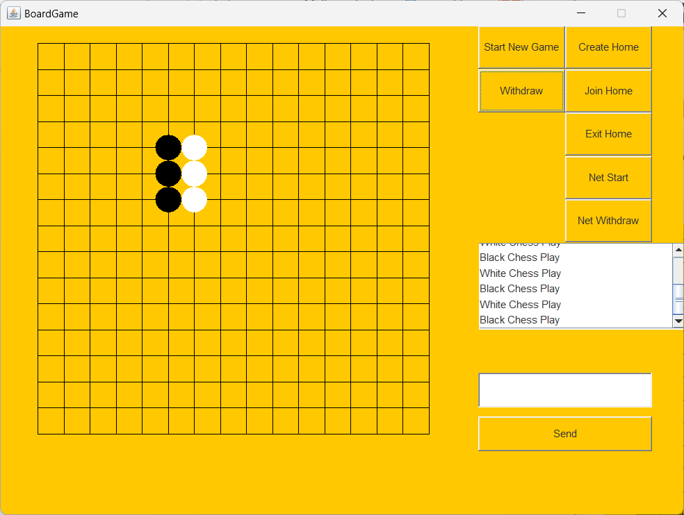
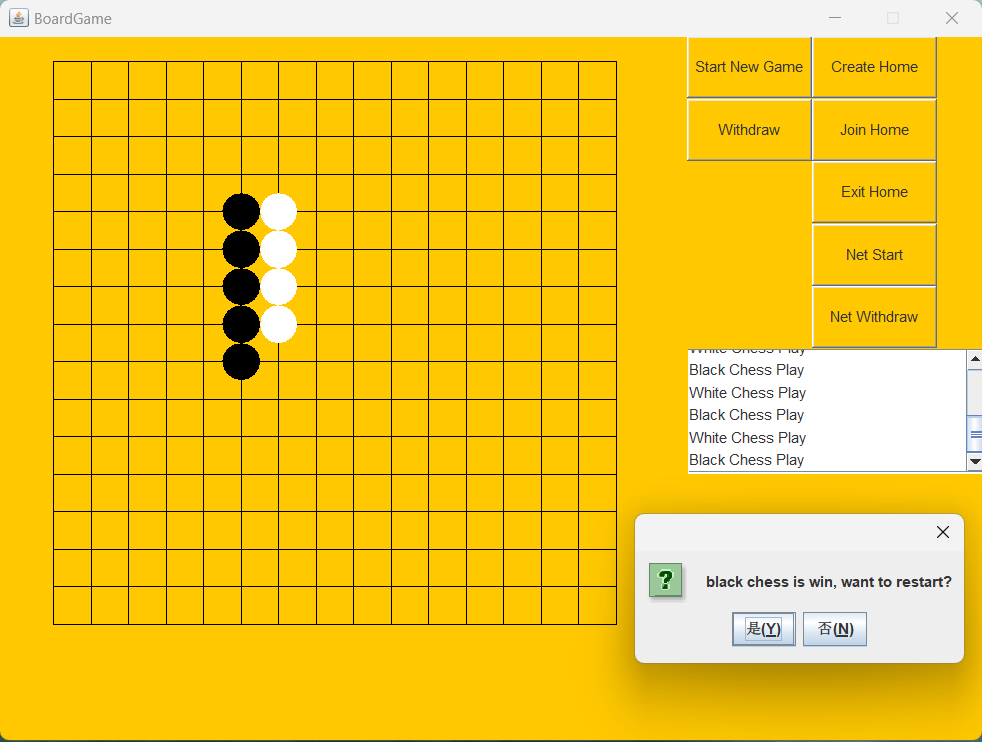
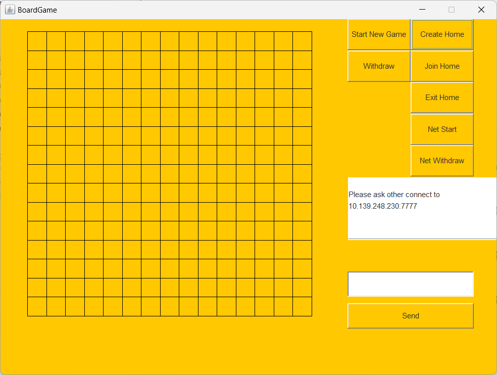
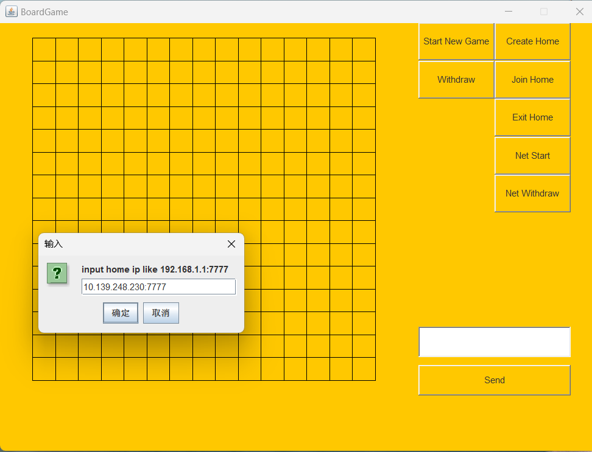
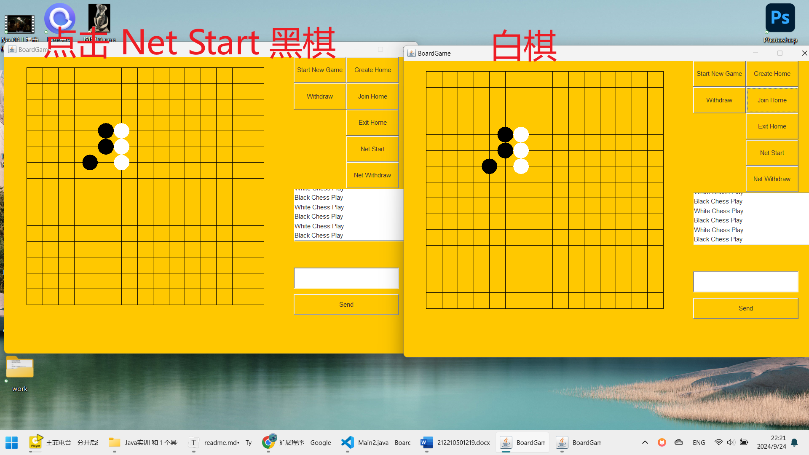
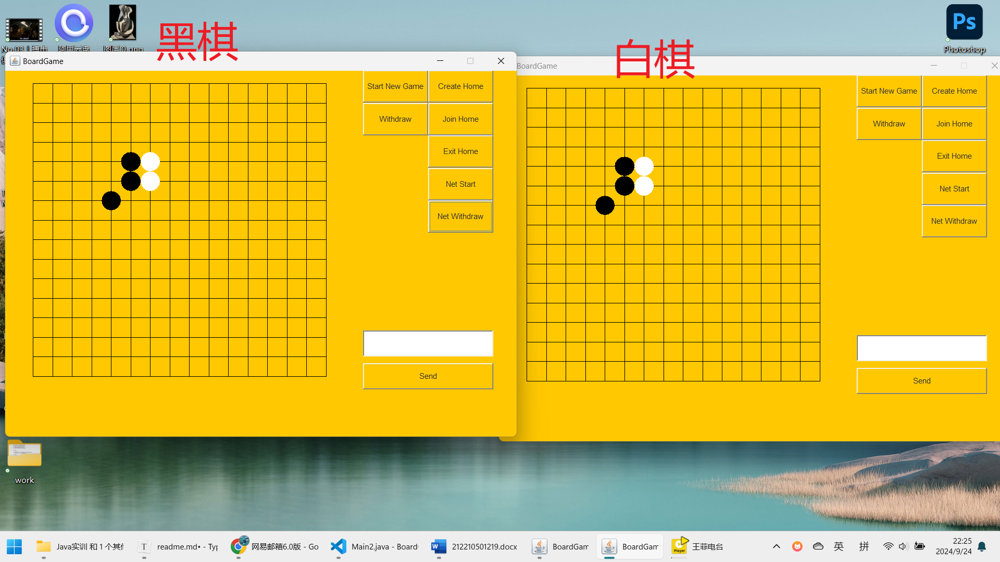
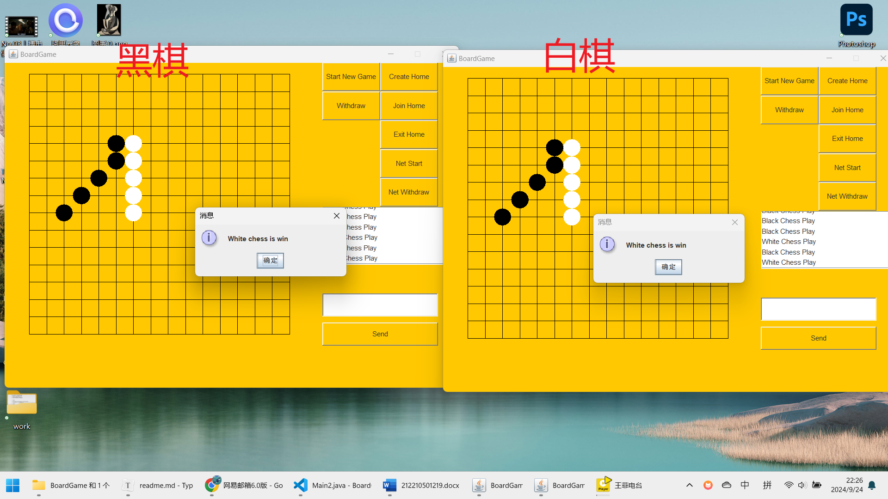
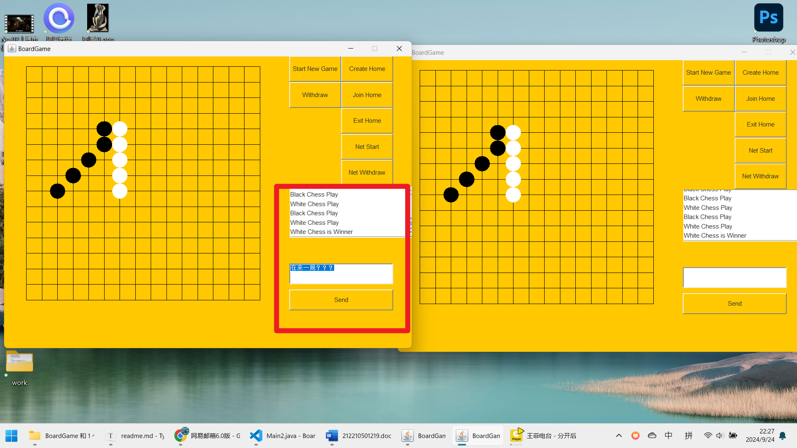
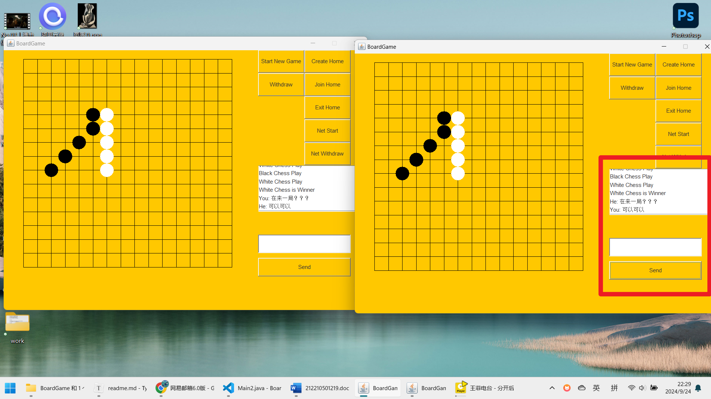

# 局域网联机五子棋

   

## 本地PVP模式

点击Start New Game 按钮开始一局本地PVP五子棋游戏，黑棋先手，白棋后手，在这之后黑棋和白棋轮流下棋。

点击Withdraw进行一次悔棋操作。

当黑棋或白棋中有一方赢得游戏时，会出现弹窗提示。点击是(Y)开始新一局本地PVP五子棋游戏，点击否(N)继续查看棋盘。

## 联网PVP模式

在开始联网游戏之前，两个玩家之间其中一个玩家要点击Create Home按钮创建一个房间，并把消息框中显示的ip地址和端口告诉另外一个玩家，等待棋加入。

另一个玩家点击Join Home按钮，并输入在前一个玩家窗口看到的IP地址和端口，并点击确定。

连接成功后，一个玩家点击Net Start按钮便开始新一局的联网PVP游戏，点击该按钮的玩家为黑棋，先手下棋，另一个玩家为白棋，后手下棋。

点击Net Withdraw可以在联网PVP模式中进行悔棋操作。

当有一方赢得游戏时，两边都会出现出现弹窗提示某一方赢得游戏。

本程序在联网PVP模式中还支持在加入同一房间的玩家之间发送聊天信息。在输入框中输入消息，并点击Send按钮发送。

右边的窗口接收到消息后进行回复。

